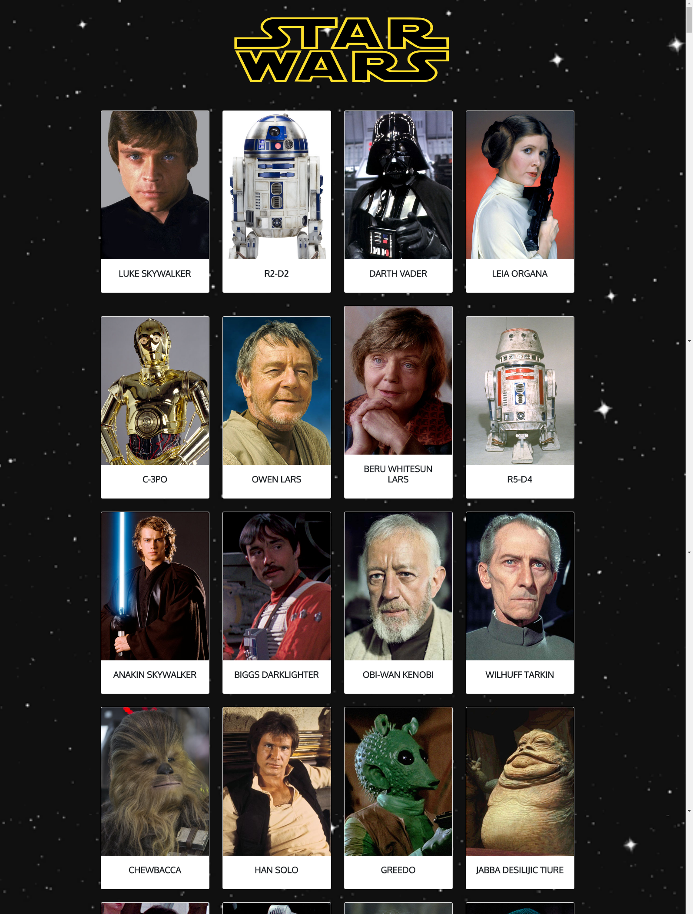

# **SWAPI**

> Recuerda seguir siempre esta [guía de estilos](https://github.com/Laboratoria/js-style-guide/)

Que la fuerza te acompañe en este ejercicio, revisa las siguientes slides para que puedas crear esta fenómenal app para los amantes de Star Wars.

* **Alumnas:** Laura Jimenez, Marina Rodriguez y Melina Pernia

## **HERRAMIENTAS:**  

* CSS
* JavaScript
* HTML
* API Swapi
* Bootstrap 4

## **DESCRIPCIÓN DEL PROYECTO:**
- Nos entregaron una api, y nos pidieron poder realizar con toda la información dada una app web donde los usuarios puedan visualizar a todos los personajes de Star Wars que al darle click aparecera un model con la informacion del personaje.

- Se tuvo que investigar el API y los parametros que se utilizan para jalar data.

- Se tuvo que investigar como enlazar data , para que el servidor lo lea y jale los datos correspondientes a cada personaje.

## **RESULTADO:**

